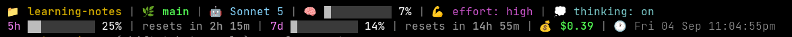

# Windows Dev Setup Guide

# Git

Install Git for Windows via winget:
> `winget install --id Git.Git -e --source winget`

Or download the installer from [git-scm.com/download/win](https://git-scm.com/download/win)

Open a new terminal after install (PATH won't update in the current session) and verify with `git --version`.

> Note: GitHub Desktop bundles its own internal copy of Git (e.g. `%LOCALAPPDATA%\GitHubDesktop\app-<version>\resources\app\git\cmd\git.exe`), but it's not added to `PATH`, so it won't be picked up by WezTerm/PowerShell/Claude Code. Installing Git for Windows separately avoids depending on GitHub Desktop's bundled version, which is versioned and can change on update.

# Terminal: WezTerm

[WezTerm](https://github.com/wezterm/wezterm) is a GPU-accelerated cross-platform terminal emulator.

### Install

Download and run the installer (`setup.exe`) from [wezterm.org/install/windows.html](https://wezterm.org/install/windows.html)

### Key bindings

#### Copy & Paste
- Copy: `Ctrl+Shift+C`
- Paste: `Ctrl+Shift+V`

#### Move by word
- `Ctrl+Left` / `Ctrl+Right` (PowerShell default)
- `Alt+Left` / `Alt+Right` (alternative, shell-dependent)

#### Tabs
- New tab: `Ctrl+Shift+T`
- Close tab: `Ctrl+Shift+W`
- Jump to tab N: `Ctrl+Shift+1` ... `Ctrl+Shift+8` (tabs 1-8), `Ctrl+Shift+9` = last tab
- Next/previous tab: `Ctrl+Tab` / `Ctrl+Shift+Tab`, or `Ctrl+PageDown` / `Ctrl+PageUp`

#### Search
- Search scrollback: `Ctrl+Shift+F`

#### Launch menu

WezTerm's `launch_menu` lists alternative shells/profiles to spawn (e.g. PowerShell in a specific folder, Git Bash, WSL) without changing the default shell. Configured via `launch_menu` in `~/.wezterm.lua`.

- Open launch menu: `Ctrl+Shift+L`
  - Not a WezTerm default binding — free to use for this
  - Ask Claude Code to set this up — requires a Lua config change in `~/.wezterm.lua` (`config.launch_menu` entries + a keybinding using `wezterm.action.ShowLauncherArgs { flags = 'LAUNCH_MENU_ITEMS' }`)

#### Color scheme

WezTerm has no built-in command-palette entry for browsing/switching color schemes. Instead, a custom keybinding was added via `~/.wezterm.lua`: it cycles through all built-in color schemes alphabetically (using `wezterm.color.get_builtin_schemes()` + `window:set_config_overrides()`) and shows a toast notification with the active scheme name.

- Cycle color scheme: `Ctrl+Shift+S`
  - Not a WezTerm default binding (verified against WezTerm's default-keys docs) — free to use for this
  - Ask Claude Code to set this up — it's not something you type directly, it requires a Lua config change in `~/.wezterm.lua` (uses `wezterm.color.get_builtin_schemes()` + `window:set_config_overrides()`)

# Claude Code

### Install

Install from [code.claude.com/docs/en/quickstart](https://code.claude.com/docs/en/quickstart). Run the following **from PowerShell** (not cmd.exe):

> `irm https://claude.ai/install.ps1 | iex`

`claude.exe` gets installed to `C:\Users\tomyw\.local\bin\` — add that path as a `PATH` environment variable.

### Setup

- Login, then run `/terminal-setup` (ensure `Shift+Enter` works)
- Run `/config`:
  - Turn off "Enable remote control for all sessions"
  - Turn off "Continue automatically at usage limit"
- Setup a status line (see below)
- Run `/advisor` to setup advisor
- Ask Claude to have WezTerm start at the projects folder (e.g. `D:\Projects`)
- Ask Claude to have WezTerm start with PowerShell, not cmd.exe
- Ask Claude to setup an alias `cc` to run `claude` with PowerShell
- Ask Claude Code to install these CLIs:
  - GitHub CLI (`gh`)
    > `winget install --id GitHub.cli -e --source winget`

### Status line

Example of the current status line:



It's a PowerShell script wired up via `~/.claude/settings.json`:

```json
{
  "statusLine": {
    "type": "command",
    "command": "powershell -NoProfile -ExecutionPolicy Bypass -File \"C:\\Users\\tomyw\\.claude\\statusline.ps1\""
  }
}
```

Script location: `~/.claude/statusline.ps1`

```powershell
param()

[Console]::OutputEncoding = [System.Text.Encoding]::UTF8
$OutputEncoding = [System.Text.Encoding]::UTF8

$ESC = [char]27
$RESET  = "$ESC[0m"
$BOLD   = "$ESC[1m"
$GREEN  = "$ESC[32m"
$BLUE   = "$ESC[34m"
$LIGHTBLUE = "$ESC[38;5;117m"
$CYAN   = "$ESC[36m"
$YELLOW = "$ESC[38;5;178m"
$MAGENTA= "$ESC[35m"
$GREY   = "$ESC[90m"
$LIGHTGREY = "$ESC[38;5;250m"
$PINK   = "$ESC[38;5;213m"
$WHITE  = "$ESC[97m"
$BARBG  = "$ESC[38;5;237m"
$DIM    = "$ESC[2m"
$UNDIM  = "$ESC[22m"

function Get-Bar([double]$pct, [int]$width = 10, [string]$activeColor = $RESET) {
    $p = [Math]::Max(0, [Math]::Min(100, $pct))
    $filled = [Math]::Round(($width * $p) / 100)
    $filledStr = '▇' * $filled
    $emptyStr = '▇' * ($width - $filled)
    return "$activeColor$filledStr$BARBG$emptyStr$activeColor"
}

function Format-Duration([Nullable[long]]$seconds) {
    if ($null -eq $seconds) { return $null }
    $s = [Math]::Max(0, $seconds)
    $days = [Math]::Floor($s / 86400); $s -= $days * 86400
    $hours = [Math]::Floor($s / 3600); $s -= $hours * 3600
    $minutes = [Math]::Floor($s / 60)
    if ($days -gt 0) { return "${days}d ${hours}h ${minutes}m" }
    if ($hours -gt 0) { return "${hours}h ${minutes}m" }
    return "${minutes}m"
}

$raw = [Console]::In.ReadToEnd()
try { $data = $raw | ConvertFrom-Json -ErrorAction Stop } catch { $data = $null }
if ($null -eq $data) { $data = [PSCustomObject]@{} }

$cwd = $data.workspace.current_dir
if (-not $cwd) { $cwd = $data.cwd }
if (-not $cwd) { $cwd = (Get-Location).Path }
$folderName = Split-Path -Leaf $cwd
if (-not $folderName) { $folderName = $cwd }

$branch = $null
try {
    $branchOut = git -C $cwd branch --show-current 2>$null
    if ($LASTEXITCODE -eq 0 -and $branchOut) { $branch = $branchOut.Trim() }
} catch { $branch = $null }

$modelName = $data.model.display_name
if (-not $modelName) { $modelName = 'unknown-model' }

$usedPct = $data.context_window.used_percentage
$effortLevel = $data.effort.level
$thinkingEnabled = $data.thinking.enabled
$sessionCost = $data.cost.total_cost_usd

$now = Get-Date

# ---- Line 1 ----
$parts1 = @()
$parts1 += "$BOLD$YELLOW📁 $folderName$RESET"
if ($branch) { $parts1 += "$BOLD$GREEN🌿 $branch$RESET" }
$parts1 += "$LIGHTBLUE🤖 $modelName$RESET"
if ($null -ne $usedPct) {
    $ctxPct = [Math]::Round($usedPct)
    $parts1 += "🧠 $(Get-Bar $ctxPct 10 $LIGHTGREY) $WHITE$ctxPct%$RESET"
}
if ($effortLevel) { $parts1 += "$MAGENTA💪 effort: $effortLevel$RESET" }
if ($null -ne $thinkingEnabled) {
    $thinkingText = if ($thinkingEnabled) { 'on' } else { 'off' }
    $parts1 += "$CYAN💭 thinking: $thinkingText$RESET"
}
$dtMain = $now.ToString('ddd dd MMM hh:mm:ss')
$dtAmPm = $now.ToString('tt').ToLower()

# ---- Line 2 ----
$parts2 = @()
$rl = $data.rate_limits
if ($rl.five_hour) {
    $pct = [Math]::Round($rl.five_hour.used_percentage)
    $parts2 += "${PINK}5h$RESET $(Get-Bar $pct 10 $LIGHTGREY) $WHITE$pct%$RESET"
    if ($rl.five_hour.resets_at) {
        $secs = $rl.five_hour.resets_at - [DateTimeOffset]::UtcNow.ToUnixTimeSeconds()
        $resetIn = Format-Duration $secs
        if ($resetIn) { $parts2 += "resets in $BOLD$resetIn$RESET" }
    }
}
if ($rl.seven_day) {
    $pct = [Math]::Round($rl.seven_day.used_percentage)
    $parts2 += "${PINK}7d$RESET $(Get-Bar $pct 10 $LIGHTGREY) $WHITE$pct%$RESET"
    if ($rl.seven_day.resets_at) {
        $secs = $rl.seven_day.resets_at - [DateTimeOffset]::UtcNow.ToUnixTimeSeconds()
        $resetIn = Format-Duration $secs
        if ($resetIn) { $parts2 += "resets in $BOLD$resetIn$RESET" }
    }
}
if ($null -ne $sessionCost) { $parts2 += "$BOLD$GREEN💰 `$$([Math]::Round($sessionCost, 2))$RESET" }
$parts2 += "$DIM🕐 $dtMain$dtAmPm$RESET"

$sep = " $DIM|$RESET "
Write-Output ($parts1 -join $sep)
if ($parts2.Count -gt 0) { Write-Output ($parts2 -join $sep) }
```

### Plugins

- Add `chrome-devtools-mcp` (lets Claude drive Chrome DevTools — inspect pages, console, network, etc.)
  > `claude plugin install chrome-devtools-mcp@claude-plugins-official`

# herdr

[herdr](https://github.com/herdrdev/herdr) is a CLI for agent automation, session state/restore, and persistence/remote access.

### Install

Run the following **from PowerShell**:

> `powershell -ExecutionPolicy Bypass -c "irm https://herdr.dev/install.ps1 | iex"`

See [herdr.dev/docs/install](https://herdr.dev/docs/install/) for alternative install methods (if endpoint security blocks the script above, or for manual install).

### Cheatsheet

See the [herdr cheatsheet](https://getmoshi.app/articles/herdr-cheatsheet) for common commands.

# cliamp

[cliamp](https://github.com/bjarneo/cliamp) is a terminal music player (Spotify, YouTube Music, radio).

### Install

Download and install from the [releases page](https://github.com/bjarneo/cliamp/releases) — pick the `amd64.zip` one as it contains the DLL files needed for Spotify.

### Setup

- Run `cliamp setup` -> pick Spotify -> Create or supply the Client ID
- Ask Claude to add the cliamp.exe location to `PATH`
